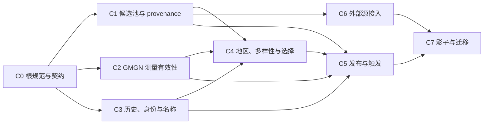

# GMGN 亚洲节点选拔 V2 实施提案

> 本文是研究提案，不是最终执行契约。与父/子任务正式规划或 [planning-resolution.md](./planning-resolution.md) 冲突时，以正式规划和收敛记录为准；例如 MVP 最短观察窗已统一为 900 秒，候选输入已统一为 `clash.yaml + status.json + candidate-metadata.json`。

> 历史研究快照：本文件保留形成方案时的分析过程。与正式父任务、子任务或 `.trellis/spec/aggregator/gmgn-v2-contract.md` 冲突时，以后者及 `planning-resolution.md` 为准；其中 600/1200 秒观察窗建议已由版本化 900 秒取代。

日期：2026-08-11
依据：`prd.md`、`research/audit-summary.md`、`research/collection-audit.md`、`research/gmgn-pipeline-audit.md`、`research/tests-ops-audit.md`

## 1. 结论与 rollout 边界

本任务不适合由一个实现任务一次完成。建议保留当前任务为父任务，父任务只负责统一契约、依赖排序、跨子任务集成审查和 rollout 决策；实际代码按可独立验收的子任务实施。

必须把以下四个门禁严格分开，前一门禁通过不自动授权后一门禁：

1. **代码完成**：离线、组件、工作流契约和 Linux Mihomo 校验全部通过；只具备手动写入 V2 影子分支的能力，不改旧 gstatic、不改现有 GMGN 正式分支、不启用新 SHA 自动触发。
2. **单次真实影子通过**：对一个固定 GitHub profile SHA 完成一次有效的 CNB 四分片、20 轮运行，并通过远端回读；仍不改默认入口。通过后才允许开启“新 profile SHA → V2 影子”自动触发。
3. **连续 3 次有效影子通过**：三个不同 profile SHA、相邻有效运行至少间隔版本化最短计数时间，且三次均通过完整门禁；失败、重复 SHA、拒绝发布或基础设施异常不计数。通过后只得到“可以申请迁移”的结论。
4. **默认入口迁移**：必须再次取得用户明确确认。迁移时把已经验收的同一 bundle 提升到正式 GMGN 分支，更新推荐地址，停止 gstatic 自动更新并把旧分支标记冻结；不删除任何旧分支或旧 URL。

建议 V2 影子期使用独立分支 `clash-cn-gmgn-v2-shadow`。该分支在同一个提交中包含 `clash.yaml`、`status.json`、脱敏诊断和最近运行索引，避免当前“shadow 已换成 B、正式 profile 仍停在 A”的跨分支失联。连续三次通过并获得用户确认后，再把已验证 bundle 原样提升到 `clash-cn-gmgn-output`，而不是重新测速后生成另一份内容。

## 2. 父任务与子任务拆分

### 父任务职责

父任务 `.trellis/tasks/08-11-gmgn-asia-selection-v2` 负责：

- 冻结跨层 schema、策略版本和“有效运行”定义；
- 建立并维护子任务依赖图；
- 审查 GitHub 候选 producer 到 CNB consumer 的完整字段流；
- 执行最终集成、单次影子、连续三次影子和默认迁移四级门禁；
- 保存每个 rollout 阶段的旧分支 tip、配置版本、远端校验结果和回滚记录。

父任务不应同时承担大范围业务实现，以免各子任务的完成状态无法独立判断。

### 建议子任务

| ID | 子任务 | 独立交付物与验收重点 | 主要依赖 |
|---|---|---|---|
| C0 | aggregator 根规范与冻结契约 | 根目录 Python/CI 规范、public/private schema、策略版本、固定 fixtures、临时目录规则 | 无；所有代码子任务的前置 |
| C1 | GitHub 候选池发布安全与 provenance | 逐源 last-success、亚洲/单区/来源 quorum 发布保护、provenance 合并、机场探索配额、名称别名安全、candidate/tested 语义 | C0 |
| C2 | GMGN 测量有效性与并发标定 | 每节点恰好 20 轮、版本化最短观察窗、逐分片出口与 canary、全局错误趋势、系统异常拒绝、workers 基准 | C0 |
| C3 | 稳定身份、跨运行历史与名称 | 稳定指纹、带密钥的公开诊断 ID、bad-run streak、迁移原因、稳定 output name、重复 SHA/无效运行不计数 | C0；可与 C1/C2 并行 |
| C4 | 真实地区、多样性、分层选择与分组 | 出口地区/ASN 缓存、unknown 降级、主力多样性硬上限、候补软降权、九个目标组、自动组仅严格层 | C1、C2、C3 |
| C5 | 事务发布、触发去重与远端 smoke | 单 bundle 原子关联、last-N 索引、force-with-lease/CAS、发布后防缓存回读、按 profile SHA 恰好触发一次、失败不写 streak | C1–C4；最终工作流集成 owner |
| C6 | 外部亚洲源受控接入 | 至少一个外部源的边际增益报告、每源/每地区/每入口限额、容量预算、受控上线与可撤销开关 | C1；可与 C4 后半段并行 |
| C7 | 影子验收与默认入口迁移 | 单次影子证据、连续三次证据、迁移确认、gstatic 冻结标记与手动恢复说明 | C5、C6 和全部代码门禁 |

## 3. 依赖顺序与可并行工作



可并行安排：

- C0 完成后，C1、C2、C3 可由三个 worker 并行实施。
- C5 可以提前只写远端校验器、事务发布纯函数和 fixtures，但 `.cnb.yml`、`.github/workflows/sync-cnb.yml` 的最终集成必须等 C1–C4 的接口冻结。
- C6 在 C1 的 provenance、限额和容量接口稳定后即可进行，不必等待 C2 全部完成。
- C4 的地区查询/cache 纯模块可提前原型化，但选择器集成必须等待 C1 provenance、C2 有效运行字段和 C3 history schema。

避免并行冲突的文件 owner：

- C1 独占 `.github/workflows/clash-verge-auto.yml`，完成后 C5 才接手其中的自动触发尾段。
- C2/C3/C4 先改 Python 模块和测试，不直接并行修改 `.cnb.yml`；C5 是 `.cnb.yml` 的最终 owner。
- C3 完成 history/identity API 后，C4 才修改 `scripts/cnb_gmgn_publish.py` 的最终选择与渲染路径。
- C7 只做 rollout 配置、文档和受控分支操作，不回头重写选择算法。

## 4. 分阶段文件范围、验证和完成门禁

### 阶段 A：C0 根规范与跨层契约

文件范围：

- `.trellis/config.yaml`：只核对 aggregator 是否仍为默认包；提案编写时已显示 `default_package: aggregator`，不要无条件重复修改。
- `.trellis/spec/aggregator/**`：补根目录 Python、unittest、GitHub Actions、CNB、公开 schema、凭据脱敏、发布/回滚和 `D:\xiangmu\linshi` 临时产物规范。
- 父/子任务的 `prd.md`、`design.md`、`implement.md` 与 schema fixtures。

冻结的最小契约：

- `candidate_status_schema_version`、`provenance_schema_version`、`gmgn_manifest_schema_version`、`history_schema_version`、`selection_policy_version`、`publish_bundle_schema_version`；
- `valid_run`：来源新鲜/hash 正确、四片完整、每候选恰好 20 次、观察窗达标、逐片 controller 健康、逐片出口/canary 可比、全局事故门禁通过、最终 Mihomo/远端 smoke 通过；
- `bad_run_countable`：`valid_run=true`、不同 source profile SHA、距离上一个可计数坏运行达到版本化间隔；建议初始按现有 6 小时候选刷新周期设为 `21600` 秒，若设计选择其他值必须有基准依据并版本化；
- 主力、候补、unknown region、source missing、invalid config、rejected run 的状态迁移表；
- public/private 字段 allowlist，禁止私有订阅 URL、token、可逆来源标识和原始错误进入公开 bundle。

完成门禁：所有后续子任务能只凭 schema fixtures 编写消费者测试；任何未定义字段不得靠名称或分支内容反推。

### 阶段 B：C1、C2、C3 并行实现

#### C1 文件范围

- `subscribe/asia.py`
- `subscribe/collect.py`
- `subscribe/crawl.py`
- `subscribe/workflow.py`
- `subscribe/clash.py`
- `subscribe/process.py`
- `scripts/build_crawler_config.py`
- `scripts/merge_clash_profiles.py`
- `scripts/apply_tcp_probe.py`
- `scripts/filter_reachability.py`
- `scripts/prepare_github_publish.py`
- `.github/workflows/clash-verge-auto.yml`
- `tests/test_asia_retention.py` 及新的 candidate/source-health 组件测试

完成门禁：单源失败、任一 HK/JP/KR/SG/TW 归零、previous 状态暂时不可读、来源 quorum 不足时均不得覆盖 last-good；精确重复项合并全部 provenance/亚洲证据；known-good 不能饿死 untried/due；status 明确区分 candidate 与 GitHub-tested。

#### C2 文件范围

- `scripts/cnb_gmgn_shadow.py`
- `scripts/cnb_mihomo_filter.py` 中可复用的 runner/controller 遥测边界
- `tests/test_cnb_gmgn_shadow.py`
- 新的 fake-clock、四分片组件和 workers 基准测试

实现要求：

- 不改变“固定快照内每候选恰好 20 轮、同节点轮次顺序执行”的基线；
- 记录每轮实际开始/结束时间和每节点首末采样间隔；正式 MVP 初始最短观察窗已收敛为版本化 900 秒，后续只能依据影子证据通过策略版本调整；
- 每个 probe 分片独立采集出口、controller/version/hash 和同一 canary 集；任一 controller 不健康或四片不可比，整轮无效；
- 全局 `round_trends`、403/429/timeout/DNS/TLS/connect/controller 分类和 control/canary 结果必须进入 publisher 可消费的脱敏输入；
- workers 首轮比较 8/12/16/24 档位，默认保持 16，只有吞吐提升且 Timeout/controller/canary 指标不显著恶化才变更；不直接尝试 32–48 作为默认值。

完成门禁：fake clock 证明观察窗；N=4、5、2260、5000 和输入重排证明稳定分片；四片缺失/出口不一致/canary 偏离/系统事故都产生 `valid_run=false`，且不生成可发布选择输入。

#### C3 文件范围

- 建议新增 `scripts/gmgn_identity.py`、`scripts/gmgn_history.py`
- `scripts/cnb_gmgn_publish.py` 仅接入 history API，不在本阶段重写最终分组
- `tests/test_cnb_gmgn_publish.py`
- 新的 `tests/test_gmgn_history.py`、`tests/test_gmgn_stable_names.py`

实现要求：

- 内部 identity 使用不含易变 name 的稳定配置指纹；公开诊断 ID 使用带密钥 HMAC 和独立的 `identity_key_version`/`identity_epoch`，不能公开裸 fingerprint；
- history 至少保存最近 3 个可计数有效运行、上次层级、bad-run streak、迁移原因、首次/最后见到、稳定 output name；
- 无效运行、拒绝发布、重复 source SHA、间隔不足的运行不能增加 streak；
- 来源暂时失败不能等价为 source disappeared；只有 C1 提供的连续有效缺失证据或配置无法加载才直接移除；
- source name 变化、输入重排、排名变化和同名冲突不能改变既有 output name；恢复达标自动晋级。

完成门禁：至少用 5 次合成运行覆盖 `core → bad1 → bad2 → bad3/remove → recovered`，并覆盖无效运行插入、重复 SHA、间隔不足、source missing、invalid config 和 HMAC key/schema 迁移失败关闭。

### 阶段 C：C4 选择器与 C6 外部源

#### C4 文件范围

- `scripts/cnb_gmgn_publish.py`
- 建议新增 `scripts/gmgn_region.py`、`scripts/gmgn_selection.py`
- `subscribe/asia.py` 只消费 C1 已冻结的标签证据，不再另写一套识别器
- `tests/test_cnb_gmgn_publish.py`
- 新的地区、多样性、分组、公开诊断关联测试

完成门禁：

- 实际出口查询覆盖本轮有响应、全部严格入选和历史保护候补，按稳定指纹缓存并有 TTL；查询失败不会阻断发布，但 unknown 不得仅凭模糊名称获得亚洲宽松主力阈值；
- 亚洲核心 `>=14/20` 且前后半程各至少 5，亚洲弹性 `10–13/20`，非亚洲基础 `>=16/20`、扩展 `>=18/20`；新亚洲节点 `response_count >= 1` 可进入仅手动候补；
- 主力和自动组执行出口 IP/server/ASN/source 硬上限；亚洲候补在总量未超过 150 时只降权和标记，不因重复直接删除；
- 输出精确包含 `👆手动优先测速`、五地区组、`🌏亚洲候补`、`🌍非亚洲稳定`、`📦全部入选`，辅助自动组只含严格稳定层；
- 少于 80 可以发布，永不为凑数降阈值；总数不超过 150、非亚洲不超过 20。

#### C6 文件范围

- `scripts/build_crawler_config.py`
- C1 建立的 provenance/source-health 配置与测试
- 外部源边际增益 fixture/报告

优先顺序：先评估并受控接入 `awesome-vpn/awesome-vpn`；若边际增益不足，再评估 Mahdibland 的限额亚洲子集。V2Hive 只能作为 reservoir，必须限制每源、每地区、每入口数量。

完成门禁：记录 raw 数、精确唯一数、唯一入口数、与现池重叠、五地区数量、更新时间和验证透明度；接入后最坏 CNB 估算仍在预算内，撤销单一 source 开关即可回退，不影响其他来源。

### 阶段 D：C5 事务发布、工作流与 smoke

文件范围：

- `.cnb.yml`（最终唯一 owner）
- `.github/workflows/sync-cnb.yml`
- C1 完成后的 `.github/workflows/clash-verge-auto.yml` 自动触发尾段
- `.github/workflows/tests.yml`
- `scripts/cnb_gmgn_publish.py` 的最终 bundle 接口
- 建议新增 `scripts/publish_transaction.py`、`scripts/validate_public_outputs.py`
- `tests/test_cnb_gmgn_shadow.py` 的 workflow contract
- 新的 publication/trigger/remote-validator 测试

实现要求：

- 先完整构建 `clash.yaml + status.json + history/state + redacted diagnostics + run index`，全部校验通过后才写一个 bundle；profile 与诊断共享同一 `run_id`、source SHA、policy version 和 bundle hash；
- V2 影子分支保留 root latest 文件以及至少最近 3 个 run 的安全诊断索引，即使分支仍压成单提交也能回看所需窗口；
- 读取 previous tip、previous bundle 和 state 必须 fail-closed；推送使用等价 `force-with-lease`/CAS，旧运行不能覆盖新 tip；
- 推送后用防缓存 URL 重新下载，校验 schema、SHA-256、数量、组引用、20 轮、4 分片、run 关联，并在 Linux 用固定 Mihomo `-t`；远端 smoke 失败时不得把该 run 标为成功或增加 streak；
- tag/锁键包含完整 source profile SHA。同一 SHA 正常只触发一次；基础设施 retry 必须显式标记并复用同一 source SHA，history 只提交一次；
- 代码完成时只保留手动 `v2-shadow` 触发；单次影子通过后才启用新 source SHA 自动触发；自动触发仍只能写 `clash-cn-gmgn-v2-shadow`。

完成门禁：并发旧 run、branch tip 被外部更新、push 失败、远端缓存旧内容、坏 previous state、缺片和 Mihomo invalid 的测试都证明受保护分支内容不变。

### 阶段 E：代码完成门禁

代码完成只表示实现可进入真实影子，不表示线上策略已验收。必须同时满足：

- C0–C6 各自验收通过；
- 全套离线、组件、工作流、真实 Linux Mihomo 检查通过；
- public/private allowlist 和凭据扫描通过；
- 当前 `clash-cn-output`、`clash-cn-gmgn-output`、文档推荐入口和 gstatic 自动任务没有被改变；
- V2 自动触发仍关闭，只能显式手动运行；
- 所有 rollback tip、策略版本、Mihomo/Python/PyYAML 版本与 hash 已记录。

### 阶段 F：单次真实影子门禁

对一个明确的 source profile SHA 手动触发，只有以下条件全部满足才算通过：

- source SHA 与触发参数、manifest、四片、bundle 完全一致；
- 每个 source candidate 恰好 20 次，首末采样覆盖最短观察窗；
- 四片出口和 canary 可比，controller/target control 正常，全局错误未触发事故门禁；
- 节点层统计、history bootstrap、地区、多样性、九组、稳定名和脱敏诊断均通过；
- 远端防缓存回读和固定 Mihomo 校验通过；
- V2 影子 bundle 可按 run_id 回看；旧 gstatic 与现有 GMGN 正式 branch tip 均未变化；
- 失败注入 canary 证明拒绝发布时 last-good V2 shadow 不变。

单次通过后，才可提交一个独立 rollout 变更，将自动触发从 `off` 切到 `shadow`。

### 阶段 G：连续 3 次有效影子门禁

三次计数必须满足：

- 三个不同 source profile SHA；相邻可计数运行至少间隔策略指定时间；
- schema、policy、Mihomo 和依赖版本一致；若版本变化，连续计数重新开始；
- 三次均为 `valid_run=true` 且远端 smoke 成功；重复事件、基础设施 retry、拒绝发布均不计数；
- 节点名称、地区 cache、history streak、恢复晋级和 bundle/run 关联跨三次稳定；
- 至少一个真实稳定指纹在三次中可安全追踪；状态机的 `bad1 → bad2 → bad3/remove → recovered` 由不进入用户订阅的确定性 rollout canary 或同三次真实 bundle 的受控 replay 证明，不能等待免费节点自然产生完整轨迹；
- 每次 V2 shadow 仍不改旧 gstatic 和现有正式 GMGN 入口。

三次通过后的输出是一份“迁移候选报告”，不是自动迁移操作。

### 阶段 H：默认入口迁移与 gstatic 冻结

只有用户明确回复同意迁移后执行：

1. 记录 `clash-cn-output`、`clash-cn-gmgn-output`、V2 shadow 的当前 tip 和 bundle hash。
2. 把最后一个已通过三次门禁的同一 V2 bundle 提升到 `clash-cn-gmgn-output`，不重新测量。
3. 远端回读正式 GMGN，确认 hash/run_id 与已验收 bundle 完全相同。
4. 更新 `CNB_SETUP.md`、`CLASH_VERGE_AUTO.md` 的推荐入口和三类订阅说明。
5. 停止 gstatic 的 schedule/自动触发；保留 `clash-cn-output` 最后一版，在 status/README 标记 `frozen=true`、冻结时间、最后 bundle hash 和手动恢复说明。
6. 保留受控手动恢复入口；不删除旧分支、不破坏旧 URL。

完成门禁：用户刷新正式 GMGN URL 后能看到目标分组，文档不再把 gstatic 作为默认；gstatic tip 内容仍可读取且有冻结标记；回滚演练能在不重新抓取历史节点的情况下恢复旧入口。

## 5. 验证命令矩阵

以下命令约定所有测试/下载/证据写入 `D:\xiangmu\linshi`，不在仓库生成临时结果。先执行：

```powershell
$TaskTemp = 'D:\xiangmu\linshi\gmgn-asia-selection-v2'
New-Item -ItemType Directory -Force -Path $TaskTemp | Out-Null
$env:TEMP = $TaskTemp
$env:TMP = $TaskTemp
$env:PYTHONPYCACHEPREFIX = Join-Path $TaskTemp 'pycache'
$env:PYTHONPATH = (Get-Location).Path
```

### 5.1 离线门禁

```powershell
python -m unittest discover -s tests -p 'test_asia_retention.py' -v
python -m unittest discover -s tests -p 'test_cnb_gmgn_shadow.py' -v
python -m unittest discover -s tests -p 'test_cnb_gmgn_publish.py' -v
python -m unittest discover -s tests -p 'test_cnb_policy_replay.py' -v
python -m unittest discover -s tests -p 'test_pipeline_utils.py' -v
python -m unittest discover -s tests -p 'test_candidate_*.py' -v
python -m unittest discover -s tests -p 'test_gmgn_*.py' -v
python -m unittest discover -s tests -v
git diff --check -- .trellis/spec .github/workflows .cnb.yml scripts subscribe tests CNB_SETUP.md CLASH_VERGE_AUTO.md
```

必须新增并由上述 pattern 命中的测试：candidate last-good/quorum、fake clock 观察窗、四片组件、history 五运行状态机、稳定名称、地区/多样性、事务发布、trigger 去重、远端 validator 和凭据 allowlist。

### 5.2 组件门禁

建议建立三个明确的组件测试入口：

```powershell
python -m unittest discover -s tests -p 'test_candidate_pipeline_component.py' -v
python -m unittest discover -s tests -p 'test_gmgn_component_pipeline.py' -v
python -m unittest discover -s tests -p 'test_publication_transaction.py' -v
```

组件 fixture 必须覆盖：本地 HTTP server 的 stale/future/hash mismatch/先错后对；prepare → 4 fake probe → merge → history → region → select → render；缺片、重复片、schema/hash/policy 不一致；previous branch 不存在与暂时不可读的区别；CAS 冲突；远端回读到旧缓存。

Linux CI/CNB 中额外执行固定 Mihomo：

```bash
sha256sum clash/clash-linux-amd
clash/clash-linux-amd -v
clash/clash-linux-amd -t -d "$RUNNER_TEMP/gmgn-v2-mihomo" -f "$RUNNER_TEMP/gmgn-v2-build/clash.yaml"
```

版本与 hash 必须写入本次 bundle status；本地 Windows 不以“无法运行 Linux 二进制”为通过依据。

### 5.3 工作流门禁

```powershell
python -m unittest discover -s tests -p 'test_workflow_contracts.py' -v
python -m unittest discover -s tests -p 'test_cnb_gmgn_shadow.py' -v
git diff --check -- .github/workflows .cnb.yml
```

若项目固定安装 `actionlint`，再执行：

```powershell
actionlint .github/workflows/*.yml
```

workflow contract 必须断言：四个独立 job/端口/目录、统一 source/main/policy、锁与超时、V2 shadow branch allowlist、代码门禁时自动触发关闭、按 profile SHA 去重、旧 gstatic/现有 GMGN 不被 V2 shadow 写入、previous 读取 fail-closed、lease/CAS、push 后 smoke、失败运行不提交 history。

### 5.4 单次 live-shadow 命令

C5 应为 `scripts.validate_public_outputs` 提供 `run/series/migration` 三个子命令。单次运行前先保存受保护分支 tip：

```powershell
$Evidence = Join-Path $TaskTemp 'live'
New-Item -ItemType Directory -Force -Path $Evidence | Out-Null
git ls-remote https://cnb.cool/ASD12321_446/aggregator.git refs/heads/clash-cn-output refs/heads/clash-cn-gmgn-output refs/heads/clash-cn-gmgn-v2-shadow | Tee-Object -FilePath (Join-Path $Evidence 'before-refs.txt')
```

手动触发接口建议扩展现有 `sync-cnb.yml`，显式传 source profile SHA：

```powershell
gh workflow run sync-cnb.yml --ref main -f trigger_gmgn_v2_shadow=true -f source_profile_sha='<PROFILE_SHA256>'
$RunId = gh run list --workflow sync-cnb.yml --limit 1 --json databaseId --jq '.[0].databaseId'
gh run watch $RunId --exit-status
```

远端防缓存校验：

```powershell
python -m scripts.validate_public_outputs run `
  --candidate-status 'https://raw.githubusercontent.com/huangazhuang/aggregator/clash-verge-output/status.json' `
  --candidate-profile 'https://raw.githubusercontent.com/huangazhuang/aggregator/clash-verge-output/clash.yaml' `
  --bundle-status 'https://cnb.cool/ASD12321_446/aggregator/-/git/raw/clash-cn-gmgn-v2-shadow/status.json' `
  --bundle-profile 'https://cnb.cool/ASD12321_446/aggregator/-/git/raw/clash-cn-gmgn-v2-shadow/clash.yaml' `
  --bundle-results 'https://cnb.cool/ASD12321_446/aggregator/-/git/raw/clash-cn-gmgn-v2-shadow/gmgn-shadow-results.json' `
  --expected-source-sha '<PROFILE_SHA256>' `
  --expected-mode shadow `
  --evidence-dir (Join-Path $Evidence '<RUN_ID>')

git ls-remote https://cnb.cool/ASD12321_446/aggregator.git refs/heads/clash-cn-output refs/heads/clash-cn-gmgn-output refs/heads/clash-cn-gmgn-v2-shadow | Tee-Object -FilePath (Join-Path $Evidence 'after-refs.txt')
```

validator 必须自行增加 nonce/no-cache header，并校验 schema、hash、数量、九组引用、20 轮、4 分片、观察窗、出口/canary、history commit、run_id/source SHA、bundle 原子关联和公开字段 allowlist。`before/after` 比较必须证明只有 V2 shadow tip 允许变化。

### 5.5 连续三次与迁移命令

三次 live evidence 均保存后执行：

```powershell
python -m scripts.validate_public_outputs series `
  --evidence-root $Evidence `
  --required-valid-runs 3 `
  --require-distinct-source-sha `
  --min-spacing-seconds 21600 `
  --require-same-policy-version `
  --require-history-canary
```

用户明确同意迁移、正式 bundle 提升完成后执行：

```powershell
python -m scripts.validate_public_outputs migration `
  --gmgn-status 'https://cnb.cool/ASD12321_446/aggregator/-/git/raw/clash-cn-gmgn-output/status.json' `
  --gmgn-profile 'https://cnb.cool/ASD12321_446/aggregator/-/git/raw/clash-cn-gmgn-output/clash.yaml' `
  --legacy-status 'https://cnb.cool/ASD12321_446/aggregator/-/git/raw/clash-cn-output/status.json' `
  --expected-bundle-hash '<LAST_ACCEPTED_V2_BUNDLE_HASH>' `
  --expect-legacy-frozen `
  --evidence-dir (Join-Path $Evidence 'migration')
```

## 6. 风险点与缓解

| 风险 | 后果 | 缓解 |
|---|---|---|
| producer/consumer schema 漂移 | provenance、错误趋势或历史字段在边界丢失 | C0 冻结版本化 schema；fixture 同时被 producer/consumer 测试消费；未知版本失败关闭 |
| 名称误判亚洲 | 非亚洲节点获得宽松阈值 | 名称只作提示；宽松主力需真实出口证据；unknown 仅进入明确降级路径 |
| 真实出口/ASN 服务限流 | 地区分组缺失或流水线整体失败 | 稳定指纹缓存+TTL；查询失败标 unknown；不得因查询服务故障覆盖 last-good |
| 403/429/Timeout/controller 系统事故被算成节点差 | 大量节点错误增加 streak、错误覆盖 | publisher 接收全局趋势、control/canary；事故运行 `valid_run=false` 且不提交 history |
| HMAC key 丢失/轮换 | 跨运行身份断裂 | 分别记录 `identity_key_version` 与 `identity_epoch`；显式迁移；缺 key/未知版本失败关闭，不把所有节点当新节点 |
| force push 或旧运行竞态 | 旧 run 覆盖新 run | 保存 observed tip，使用 lease/CAS，拒绝更旧 run_at/source sequence；bundle 单提交原子关联 |
| 自动触发风暴/同 SHA retry | 短时事故快速耗尽三次保护 | trigger key 使用完整 profile SHA；重复 SHA 幂等；retry 与 history commit 分离；最短计数间隔 |
| 外部大源导致候选暴增 | CNB 超预算、运行超时 | 接入前边际增益和最坏耗时计算；每源/地区/入口限额；接近 5000 先评估，不无界接入 |
| 免费节点自然状态无法覆盖完整迁移轨迹 | 三次 live 仍无法证明 bad3/remove/recover | 使用不进入用户订阅的确定性 history rollout canary，或对三次真实 bundle 做受控 replay；结果单独标记 |
| 多 worker 同时修改工作流/selector | 合并冲突和契约漂移 | 按本文文件 owner 排序；`.cnb.yml` 只由 C5 最终集成；C4 等 C3 API 冻结 |
| gstatic 过早停更 | 用户失去可靠回滚对照 | 只在连续三次通过且用户确认后冻结；保留 URL、最后 tip 和手动恢复入口 |

## 7. 回滚点

### R0：代码门禁前

- 只回滚本地/PR 代码；线上所有分支和触发器不应发生变化。
- 若 schema 或组件测试不收敛，回到 C0，不进入 live。

### R1：单次影子失败

- 保持 V2 自动触发关闭；旧 gstatic 与现有 GMGN 正式分支不动。
- V2 shadow 使用 last-good/CAS，不用失败 bundle 覆盖；失败证据保存在独立诊断和 `D:\xiangmu\linshi`。
- 修复后重新使用新的 run_id；同 source SHA 的基础设施 retry 不增加 history。

### R2：连续三次期间失败

- 将自动触发从 `shadow` 切回 `off`，保留最后一个有效 V2 shadow bundle。
- 任何 policy/schema/Mihomo 版本变化都清零“连续三次”验收计数，但不删除已有诊断。
- 不触碰默认入口或 gstatic。

### R3：默认迁移后回滚

- 使用迁移前记录的 branch tip/bundle hash，把推荐文档和入口重新指向仍保留的 `clash-cn-output`。
- 恢复 gstatic 手动/定时触发，移除“当前默认”标记但保留冻结历史说明；不删除 GMGN 或 gstatic 分支。
- 正式 GMGN 保持最后一个 good bundle，停止继续提升新 bundle，直至故障原因解决并重新通过影子门禁。

## 8. 父任务最终完成门禁

父任务只能在以下全部完成后归档：

- [ ] C0–C6 均有独立测试证据和完成记录，C7 有 rollout 证据。
- [ ] 固定快照内每候选恰好 20 轮、最短观察窗、四片一致性、全局事故门禁均可自动验证。
- [ ] GitHub last-good/source quorum/provenance/探索配额与至少一个外部亚洲源受控接入已验证。
- [ ] history 连续三次语义、稳定名称、恢复晋级、无效运行不计数已由组件和 live canary/replay 同时证明。
- [ ] 真实地区、多样性、九组、自动组严格层、80/150/20 容量边界全部通过。
- [ ] bundle 原子关联、last-N 可回看、lease/CAS、exactly-once trigger、远端 smoke 和失败回滚通过。
- [ ] 单次真实 V2 影子通过，且未改变旧默认。
- [ ] 连续 3 次不同 SHA 的有效 V2 影子通过，且 policy/runtime 版本一致。
- [ ] 用户明确确认默认入口迁移。
- [ ] 正式 GMGN 与最后验收 bundle hash 一致；gstatic 分支未删除、URL 可用、状态明确冻结并有受控恢复方法。
